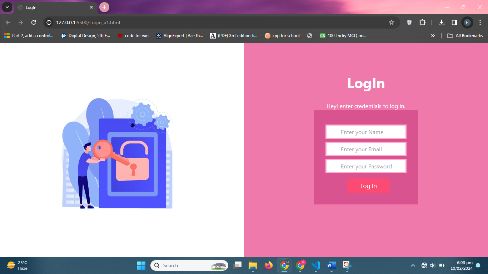

<h1>Web Programming Assignment 1</h1>
<h2>Task-1: Portfolio Design</h2>

Screen Shot

 
 
<h2>Task-2: Sign Up Page</h2>
 

animation on sign up button, changes color on hover

 
<h2>Task-3: LogIn Page</h2>
 

animation on login button, changes color on hover

 

